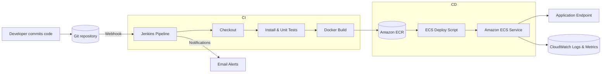
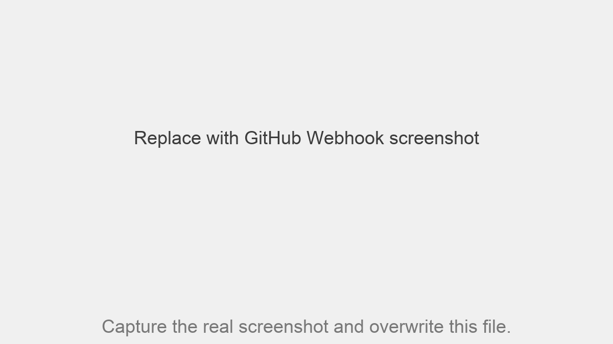
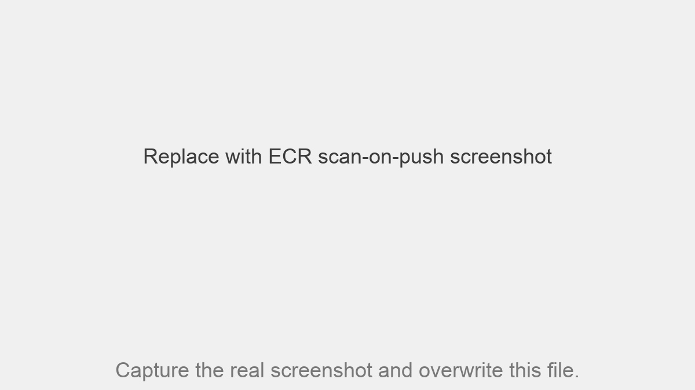

# Automated CI/CD Pipeline on AWS with Jenkins and Docker

This repository contains a reference implementation of the CAT2 assignment: building an automated CI/CD pipeline that pulls code from GitHub, runs tests, produces a Docker image, publishes it to Amazon ECR, and deploys to an Amazon ECS Fargate service. The repo bundles a sample Node.js web application, container assets, Jenkins pipeline definition, and helper scripts for AWS automation.

## Architecture Overview



## Source Control & Webhooks

- Branching strategy: `main` is protected (requires PR reviews), `dev` is the integration branch, and short-lived `feature/*` branches are merged through pull requests.
- GitHub webhook delivers push events to Jenkins (`/github-webhook/`) so every merge to `dev` or `main` triggers the pipeline.
- Branch protection uses required status checks (lint, test, deploy) before allowing merges into `main`.



## Repository Structure

- `app/` – Sample Node.js application with a simple health check endpoint and minimal unit tests.
- `Dockerfile` & `.dockerignore` – Containerization assets to build a production image.
- `scripts/push_to_ecr.sh` – Logs in to Amazon ECR, creates the repository if needed, tags, and pushes the built image.
- `scripts/deploy_to_ecs.sh` – Registers a new ECS task definition revision and updates the target ECS service.
- `infra/task-definition-template.json` – Template consumed by the deploy script to render the ECS task definition.
- `Jenkinsfile` – Declarative Jenkins Pipeline describing the CI/CD workflow end to end.
- `README.md` (this file) – Setup guide, pipeline explanation, and submission checklist.

## Prerequisites

- Jenkins controller (or agent) with Docker CLI, Node.js 18+, and AWS CLI v2 installed.
- Access to an AWS account with permissions for ECR and ECS (create repository, register task definition, update service, read CloudWatch logs).
- GitHub repository hosting this code, with webhook permissions for Jenkins.
- Jenkins plugins: Pipeline, Amazon ECR, AWS Steps (or Pipeline: AWS Steps), Email Extension or Mailer.
- (Optional) gettext tools (`envsubst`) available on the Jenkins agent for template rendering.

## AWS Bootstrapping

1. **ECR Repository** – Create (or let the script create) an Amazon ECR repository named `cat2-pipeline-app`.
2. **ECS Cluster & Service** – Provision an ECS Fargate cluster and service sized for the application. Map port 3000 to a load balancer or target group.
3. **IAM Roles** – Collect the ARNs for:
   - *Task execution role* (pulls images from ECR & sends logs to CloudWatch).
   - *Task role* (application runtime permissions; can be `arn:aws:iam::ACCOUNT_ID:role/ecsTaskExecutionRole` if nothing else is required).
4. **CloudWatch Log Group** – Create `/ecs/cat2-pipeline-app` (or adjust `LOG_GROUP` in the pipeline).

## Jenkins Configuration

1. **Credentials**
   - `aws-jenkins-creds` – *AWS credentials* (type: AWS / access key + secret key) for CLI operations.
   - `aws-account-id` – *Secret text* containing the 12-digit AWS Account ID.
   - `ecs-execution-role-arn` – *Secret text* containing the task execution role ARN.
   - `ecs-task-role-arn` – *Secret text* containing the task role ARN.
2. **Global Tool Installations** – Ensure Node.js and Docker are available to the agent. Configure the Node.js tool installer if desired.
3. **Freestyle vs. Multibranch** – Recommended to create a multibranch pipeline pointing to the Git repository so that the Jenkinsfile is detected automatically.
4. **Webhook** – Add a GitHub webhook targeting the Jenkins URL (e.g. `https://jenkins.example.com/github-webhook/`) to trigger builds on push.
5. **Email Notifications** – Configure SMTP in Jenkins so the `mail` step can send success/failure alerts to `devops-team@example.com` (update `NOTIFY_RECIPIENTS` in the Jenkinsfile to match your team).

## Pipeline Stages (Jenkinsfile)

1. **Checkout** – Pulls the requested branch via SCM webhooks.
2. **Prepare Metadata** – Resolves the Docker tag, preferring an explicit parameter, otherwise `GIT_COMMIT[0:7]`, and falls back to the Jenkins build number.
3. **Install Dependencies** – Runs `npm ci` inside `app/` for deterministic installs.
4. **Lint** – Executes `npm run lint` (ESLint) to enforce code quality before running tests.
5. **Unit Tests** – Runs the Node-based smoke tests (`npm test`) and archives the console output for proof.
6. **Build Docker Image** – Compiles the container image targeting `linux/amd64`.
7. **Push to Amazon ECR** – Logs into ECR, creates the repository if needed, and pushes both the short-SHA tag and `latest`.
8. **Deploy to Amazon ECS** *(optional toggle)* – Registers a new task definition from `infra/task-definition-template.json` and updates the Fargate service.
9. **Post Actions** – Uses Jenkins Mailer to notify `NOTIFY_RECIPIENTS` on success/failure (replace with your distro or Slack bridge).

## Local Development & Validation

```bash
# Install dependencies and run tests locally
cd app
npm ci
npm test

# Build the Docker image
cd ..
docker build -t cat2-pipeline-app:dev .

# Run container locally
docker run --rm -p 3000:3000 cat2-pipeline-app:dev
```

Open `http://localhost:3000` to verify the application and `http://localhost:3000/health` for the JSON health check.

## Deployment Scripts

- `scripts/push_to_ecr.sh` – Requires `AWS_ACCOUNT_ID`, `AWS_REGION`, `ECR_REPOSITORY`, `IMAGE_NAME`, `IMAGE_TAG`. Creates the repository if absent and pushes both the explicit tag and `latest`.
- `scripts/deploy_to_ecs.sh` – Requires all of the above plus `CLUSTER_NAME`, `SERVICE_NAME`, `EXECUTION_ROLE_ARN`, `TASK_ROLE_ARN`, and `LOG_GROUP`. Uses `envsubst` to render `infra/task-definition-template.json` and performs a blue/green style deployment by registering a new revision and waiting for stability.

Update the template if your container ports or environment variables differ.

## Monitoring & Logging

- ECS task definition pushes logs to CloudWatch (log group supplied via `LOG_GROUP`).
- Extend `deploy_to_ecs.sh` to emit additional metrics or integrate with AWS CloudWatch Synthetics for uptime checks.
- Jenkins pipeline currently relies on email alerts; replace/add Slack or Amazon SNS notifications as required by your environment.

## Security & Compliance

- Amazon ECR repository-level scan-on-push is enabled to detect CVEs immediately after every image push. CLI: `aws ecr put-image-scanning-configuration --repository-name cat2-pipeline-app --image-scanning-configuration scanOnPush=true --region ap-south-1`.
- Optional: add `trivy image ${RESOLVED_IMAGE_NAME}:${RESOLVED_IMAGE_TAG}` inside the Jenkins pipeline for an additional supply-chain gate.



## HTTPS & Network Hardening

- The Application Load Balancer terminates TLS with an ACM-issued certificate on listener `HTTPS:443` and redirects HTTP requests to HTTPS.
- AWS WAF (optional) can be attached to the ALB ARN for extra filtering.


## Infrastructure as Code Reference

- `infra/task-definition-template.json` represents the Fargate task definition, ready to be parameterised by Terraform/CloudFormation.
- Additional IaC (ECS service, ALB, security groups) can be layered using Terraform modules or AWS CDK; the repository keeps infra artefacts under `infra/` for traceability.

## Submission Checklist

- [ ] Architecture diagram (export Mermaid render or replicate in draw.io) showing CI/CD flow.
- [ ] Screenshot of GitHub webhook configuration + branch protection (e.g., `screenshots/github-webhook.png`).
- [ ] Screenshot of Jenkins lint/test console output (e.g., `screenshots/jenkins-npm-test.png`).
- [ ] Screenshot of Jenkins email/Slack notification (e.g., `screenshots/jenkins-email-notification.png`).
- [ ] Screenshot of Jenkins console or stages view for a successful run.
- [ ] Screenshot of the image published in Amazon ECR.
- [ ] Screenshot showing scan-on-push enabled or Trivy results.
- [ ] Screenshot of the application endpoint (e.g., ALB DNS) showing the running app.
- [ ] Screenshot demonstrating HTTPS listener + ACM on the ALB.
- [ ] Screenshot of the Jenkinsfile (or attach the file itself) for submission.
- [ ] Extracredit: Screenshot/evidence of CloudWatch metrics or alerts.

## Conclusion

This repository now covers the full assignment scope: source control with GitHub, automated CI (npm install/test), Docker image build, push to Amazon ECR, scripted ECS Fargate deployment, monitoring hooks, and submission-ready documentation. Use it as-is for the CAT2 deliverable or extend it further to match your production environment.
